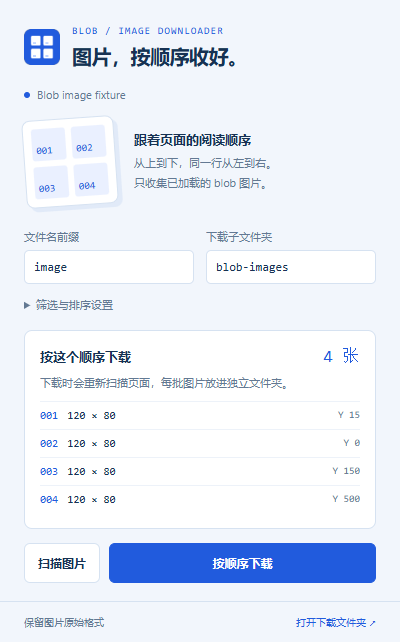

# Blob 图片顺序下载

[English](README.md) · **简体中文**

一个轻量的 Chrome / Edge 浏览器扩展：把当前网页中已加载、可见的 **blob 图片**按阅读顺序批量保存。源自控制台下载脚本，使用 Manifest V3，无打包工具，无运行时依赖。



## 安装

1. 下载 [最新版本 ZIP](https://github.com/gulzxeric/blob-image-downloader/releases/latest)，解压到一个固定位置。也可以克隆仓库，直接使用其中的 `extension` 文件夹。
2. Chrome 打开 `chrome://extensions`；Edge 打开 `edge://extensions`。
3. 开启「开发者模式」，点击「加载已解压的扩展程序」。
4. ZIP 安装时选择解压后**直接包含 `manifest.json` 的文件夹**；克隆仓库时选择 `extension` 文件夹。
5. 将扩展固定到浏览器工具栏。

不需要运行 npm，也不需要登录 GitHub。此版本以可加载的扩展 ZIP 发布，未上架 Chrome / Edge 扩展商店。

## 使用

1. 打开包含 blob 图片的普通网页。先滚动页面，让需要的图片加载出来。
2. 点击工具栏的扩展图标，点击「扫描图片」。弹窗会列出数量、尺寸和排序。
3. 可修改文件名前缀与下载子文件夹；修改后重新扫描。
4. 点击「按顺序下载」。插件会重新扫描当前页面，将每一批保存到浏览器下载目录下的独立文件夹，例如：

   ```text
   Downloads/blob-images/20261001-153000-a12b34/
     image_001.png
     image_002.jpg
     image_003.webp
   ```

5. 弹窗显示浏览器确认的「已保存 / 失败 / 保存中 / 未提交」。鼠标悬停在失败条目上可看原因。

关闭弹窗不会停止下载。点击「停止提交」会停止后续图片；已经交给浏览器的下载仍继续。保持来源页面打开；刷新、关闭或离开来源页面会终止尚未提交的图片。

## 筛选与顺序

- 只检查主页面 DOM 中的 ``，并要求 `img.src` 以 `blob:` 开头。
- 默认要求原始宽、高**都严格大于 50 px**，与原脚本一致；可调整。
- 排除未加载、没有布局尺寸、隐藏或完全透明的图片及隐藏祖先中的图片。支持可见的固定定位图片。
- 已加载但在屏幕之外的图片也会收集；不自动滚动，不等待懒加载，不穿透 iframe 或 Shadow DOM，不收集普通 HTTP 图片或 CSS 背景图。
- 先按文档纵坐标排序，再将顶部距该行最上方图片不超过 20 px 的图片归为同一行，行内从左到右。容差可调整。
- 以行的最上方坐标为锚点，避免原脚本的近似比较器不满足传递性。瀑布流、重叠图片或嵌套滚动容器可能需要调整容差。
- 同一个 blob URL 在页面中出现多次时，每个符合条件的 `` 都独立编号，与原脚本一致。

## 原始格式与限制

图片字节原样保存，不做转码，不强行改成 PNG。常见 PNG / JPEG / WebP / GIF / AVIF / BMP 会检测文件头；其他已声明的支持格式采用原始 MIME，未知格式使用 `.bin`。

blob URL 只在页面生命周期中有效。已经被页面撤销的 URL 会报告失败，即使图片仍显示在屏幕上。单张图片上限为 **24 MiB**，超过时跳过并报告失败，以避免浏览器扩展消息大小限制和过高内存使用。逐张读取并提交，默认间隔 300 ms，可在 100–3000 ms 内调整。

在 `chrome://`、`edge://`、浏览器扩展商店等禁止注入的页面无法使用。本地文件网页需在扩展详情中启用「允许访问文件网址」。浏览器或企业策略仍可能阻止下载；如设置了逐次询问保存位置，可能出现保存对话框。下载目录由浏览器设置决定，插件填写的是目录内的相对子文件夹。

状态保存在浏览器会话内，弹窗重开或扩展后台休眠后可以重新核对已提交的下载。浏览器重启后不恢复未完成的批次。

## 权限与隐私

仅请求：

| 权限 | 用途 |
| --- | --- |
| `activeTab` | 点击插件后临时访问当前网页 |
| `scripting` | 在当前主页面收集并读取 blob 图片 |
| `downloads` | 保存图片并确认下载结果 |
| `storage` | 保存设置及当前会话的进度 |

不请求全站访问权限；不在后台自动扫描网页。无远程代码、分析服务或数据上传。图片数据只在网页、插件与浏览器下载功能之间本地传递；仅下载任务的元数据进入会话存储。

## 开发与测试

需要 Node.js 22 或更新版本。扩展源文件可直接加载。

```sh
npm ci
npm run check
npm test
npx playwright install chromium
npm run test:e2e
npm run package
```

浏览器测试使用独立临时配置和本地图片测试页，会在浏览器下载目录产生 `blob-images-e2e` 文件夹。测试副本临时添加 `http://127.0.0.1/*` 权限，以模拟点击工具栏后获得的页面权限；**发布的 manifest 不包含这个权限**。测试关闭后删除独立临时配置，不修改日常浏览器。

端到端测试覆盖：隐藏、小尺寸及非 blob 图片排除，DOM 与视觉顺序不一致，固定定位，滚动，原始字节与文件格式，失效 URL，停止提交，真实弹窗交互，以及关闭弹窗后继续下载并恢复进度。

`npm run package` 输出 `dist/blob-image-downloader-v1.0.1.zip`，ZIP 根目录直接包含 `manifest.json` 和 MIT 许可证，可解压加载或用于商店提交。图标可用 `python scripts/generate-icons.py` 重新生成（仅使用标准库）。

API 行为参考：[Chrome 下载 API](https://developer.chrome.com/docs/extensions/reference/api/downloads)、[脚本注入 API](https://developer.chrome.com/docs/extensions/reference/api/scripting)、[会话存储 API](https://developer.chrome.com/docs/extensions/reference/api/storage)。

## 许可证与商店提交

本项目使用 [MIT 许可证](LICENSE)。隐私说明见 [PRIVACY.md](PRIVACY.md)。

Chrome / Edge 上架文案、权限用途、审核测试说明和图片位于 [store](store/README.md)。目前尚未提交商店审核：发布者还需要注册并登录商店开发者账号。
